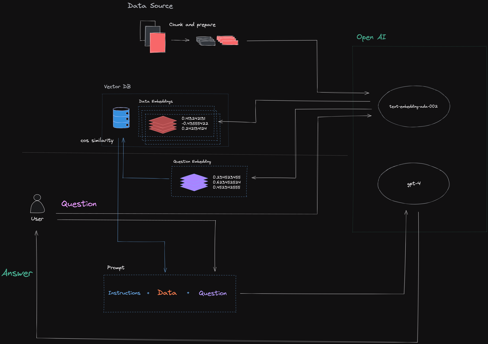

# AI Hackathon

```
  ______
 /      \
|  0  0  |
 \______/
```

## Getting Started

### Installing Dependencies

```sh
npm i -g pnpm
pnpm i
```

### Initialize Secrets

1. Run `cp .env.sample .env`
2. Follow instructions to initialize secrets

## Example

1. Process Articles from SharePoint `npx tsx data/read-sp-data.ts`
2. Create Embeddings `npx tsx data/create-embeddings.ts`
3. Run Chat `npx tsx src/chat.ts`

## Resources



- [OpenAI Cookbook - Question anwsering using embeddings](https://github.com/openai/openai-cookbook/blob/594fc6c952425810e9ea5bd1a275c8ca5f32e8f9/examples/Question_answering_using_embeddings.ipynb)
- [OpenAI Cookbook - Embedding Wikipedia articles for search](https://github.com/openai/openai-cookbook/blob/594fc6c952425810e9ea5bd1a275c8ca5f32e8f9/examples/Embedding_Wikipedia_articles_for_search.ipynb)
